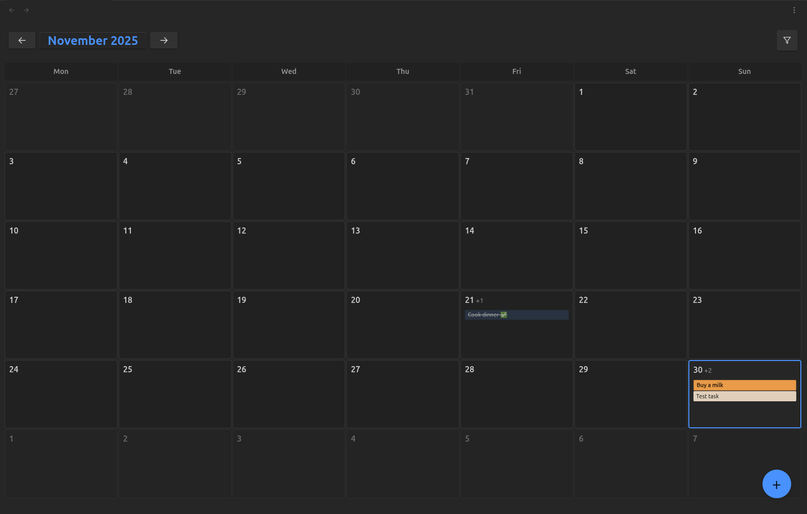
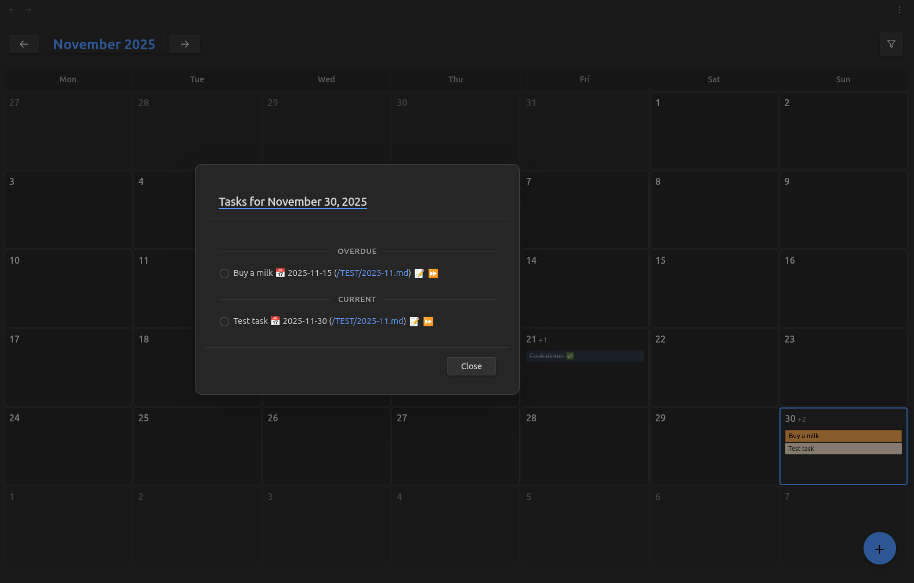
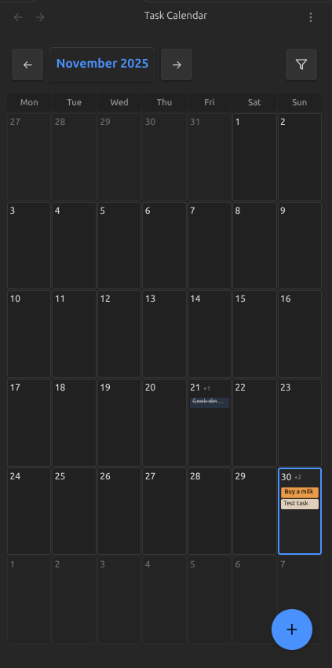

# Calendar view for "Tasks" plugin

A full-featured calendar for daily notes based on the [tasks plugin](https://github.com/obsidian-tasks-group/obsidian-tasks).
Designed with Google Calendar in mind, with gesture support for mobile devices.

# Screenshots

# Usage

Open the task calendar

- `CTRL + P` - `Calendar view for Tasks plugin: Open task calendar` 

Scrolling with the middle mouse wheel switches the months of the calendar.

Gestures are also implemented on mobile devices.

Swiping left or right on the calendar will switch between months, and if you open a task modal and swipe left or right, you can also switch between days.

All task management functionality from the tasks plugin also works.

In the modal window, if you click on the date, you will be redirected to the file where the tasks shown are located.

# Settings

1. Create task folder path - The folder where tasks will be saved when quickly added.
2. Filename format - the date format that will be indicated in the file header (`YYYY`, `YYYY-MM`, `YYYY-MM-DD`).
3. Calendar tasks folder path - folder with your tasks.
4. Auto-open calendar on startup - If you enable it, the plugin will open first when you open Obsidian.
5. You can also select the language and colors for displaying tasks in calendar cells (you can select a preset or specify your own color).
